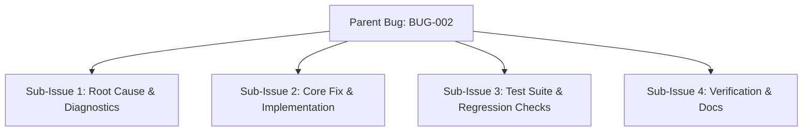
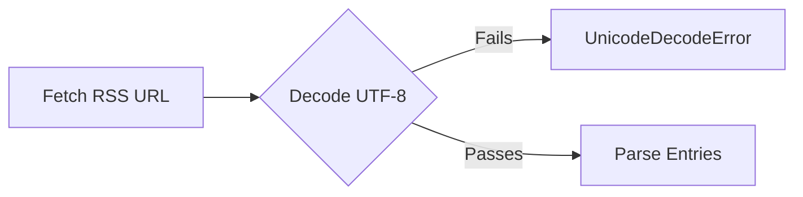
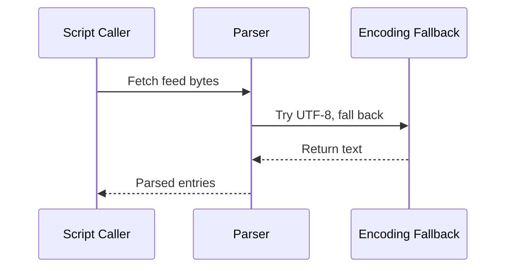

# Bug Report: [BUG-002] Feed Parser Fails on Non-UTF-8 RSS Content

## Metadata
- **Bug ID**: BUG-002
- **Status**: Investigating
- **Priority**: Medium
- **Component**: Python Scripts / Feed Parser
- **Reported Date**: 2026-09-07
- **Target Resolution**: Phase 2
- **GitHub Issue**: [#2](https://github.com/HELIX-Origin/Site-Feed-Discord/issues/2)

---

## Sub-Issues & Milestone Breakdown

- [ ] **Sub-Issue 1: Root Cause & Diagnostics** (`#5`)
- [ ] **Sub-Issue 2: Core Fix & Implementation** (`#6`)
- [ ] **Sub-Issue 3: Test Suite & Regression Checks** (`#7`)
- [ ] **Sub-Issue 4: Verification & Docs** (`#8`)

---

## Description
When an RSS feed contains non-UTF-8 encoded characters (e.g., legacy forum posts with ISO-8859-1 encoding), `urllib.request.urlopen()` may return bytes that cause `.decode('utf-8')` to raise `UnicodeDecodeError`.

## Reproduction & Error Flow

## Steps to Reproduce
1. Configure `SITE_URL` to a legacy forum with ISO-8859-1 RSS output.
2. Run `python scripts/post_feed_to_discord.py` manually.
3. Observe traceback pointing to `.decode('utf-8')`.

## Expected Behavior
The parser should attempt UTF-8 first, fall back to `latin-1` or detect encoding via `chardet` (only if user approved), and log a warning rather than crash.

## Actual Behavior
Script crashes with unhandled `UnicodeDecodeError`, stopping the workflow and producing no Discord posts.

## Environment Details
- **OS**: Linux
- **Python Version**: v3.11
- **Site-Feed-Discord Version**: 1.0.0

## Resolution Architecture

## Resolution & Fix
Implement a safe decode loop: `data.decode('utf-8', errors='replace')` or `latin-1` fallback, with explicit user opt-in for external encoding libraries.
