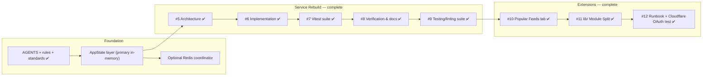

# Discord RSS — Rebuild Roadmap

> The live tracking roadmap is **GitHub Issue #4** (`[PLAN] Multi-user Discord RSS rebuild`) at `HELIX-Origin/Discord-RSS`. This file mirrors the local context and links to the legacy phase plans.

## Milestones & GitHub Tracking

| Item | Milestone | Status | Tracking |
|------|-----------|--------|----------|
| Standards | Roadmap-first issue/PR/commit standards, emoji commit matrix | Done (local, Rule 04 + templates) | `.agents/rules/remote-issue-protocol.md` |
| AppState | In-memory primary layer over SQLite write-through, optional Redis | Done | [#5](https://github.com/HELIX-Origin/Discord-RSS/issues/5) |
| Implementation | Repository write-through, RedisCoordinator, watcher locks/config wiring | Done | [#6](https://github.com/HELIX-Origin/Discord-RSS/issues/6) |
| Tests | Vitest suite rebuild (state, auth, xml/parser, html/scraper, webhook, router) | Done | [#7](https://github.com/HELIX-Origin/Discord-RSS/issues/7) |
| Verification | Smoke test (register -> webhook -> preset feed -> poll), agents rewrite, docs/wiki | Done | [#8](https://github.com/HELIX-Origin/Discord-RSS/issues/8) |
| Popular Feeds | Dashboard tab with presets + one-click add | Done | [#10](https://github.com/HELIX-Origin/Discord-RSS/issues/10) |
| `lib/` split | Large modules decomposed under `src/lib/` | Done | [#11](https://github.com/HELIX-Origin/Discord-RSS/issues/11) |
| Runbook + OAuth | Reproduction-safe runbook + Cloudflare OAuth mocks | Done | [#12](https://github.com/HELIX-Origin/Discord-RSS/issues/12) |

## Legacy Phases (superseded)

The original 8-phase plan (`phase1.md`..`phase7.md`) described the legacy Site-Feed-Discord Python/Discohook architecture and is superseded by the multi-user Discord RSS rebuild. `phase8.md` was removed. These files are retained as historical context only.

## Progress Notes (roadmap-first, Rule 04)

- Progress updates belong in the **first post** of GitHub Issue #4 (`gh issue edit 4 --body-file <roadmap.md>`), never new comments.
- New discoveries get added to the Issue #4 roadmap, followed by a single explanatory comment.
- All sub-issues (#5–#12) are closed; the parent roadmap acceptance criteria are fully met. `npm run check` passes with 95 tests.