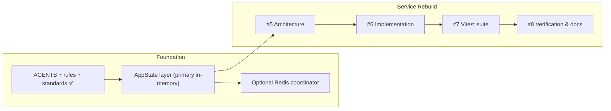

# Discord RSS — Rebuild Roadmap

> The live tracking roadmap is **GitHub Issue #4** (`[PLAN] Multi-user Discohook RSS rebuild — progress checkpoint & roadmap`) at `HELIX-Origin/Site-Feed-Discord`. This file mirrors the local context and links to the legacy phase plans.

## Milestones & GitHub Tracking

| Item | Milestone | Status | Tracking |
|------|-----------|--------|----------|
| Standards | Roadmap-first issue/PR/commit standards, emoji commit matrix | Done (local, Rule 04 + templates) | `.agents/rules/remote-issue-protocol.md` |
| AppState | In-memory primary layer over SQLite write-through, optional Redis | In progress (implementation) | [#5](https://github.com/HELIX-Origin/Site-Feed-Discord/issues/5) |
| Implementation | Repository write-through, RedisCoordinator, watcher locks/config wiring | Open | [#6](https://github.com/HELIX-Origin/Site-Feed-Discord/issues/6) |
| Tests | Vitest suite rebuild (state, auth, xml/parser, html/scraper, webhook, router) | Open | [#7](https://github.com/HELIX-Origin/Site-Feed-Discord/issues/7) |
| Verification | Smoke test (register -> webhook -> preset feed -> poll), agents rewrite, docs/wiki | Open | [#8](https://github.com/HELIX-Origin/Site-Feed-Discord/issues/8) |

## Legacy Phases (superseded)

The original 8-phase plan (`phase1.md`..`phase7.md`) described the legacy Site-Feed-Discord Python/Discohook architecture and is superseded by the multi-user Discord RSS rebuild. `phase8.md` was removed. These files are retained as historical context only.

## Progress Notes (roadmap-first, Rule 04)

- Progress updates belong in the **first post** of GitHub Issue #4 (`gh issue edit 4 --body-file <roadmap.md>`), never new comments.
- New discoveries get added to the Issue #4 roadmap, followed by a single explanatory comment.