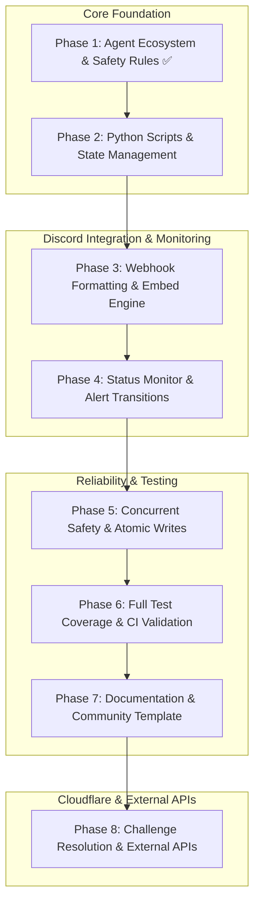

# Site-Feed-Discord -- Project Roadmap

---

## Phase Milestones & GitHub Tracking

| Phase | Milestone Name | Status | GitHub Issue | Sub-Issues |
|-------|----------------|--------|--------------|------------|
| **Phase 1** | Agent Ecosystem & Safety Rules | Completed | N/A | 4 Sub-Tasks |
| **Phase 2** | Python Scripts & State Management | In Progress | [#1](https://github.com/HELIX-Origin/Site-Feed-Discord/issues/1) | Sub-Tasks |
| **Phase 3** | Webhook Formatting & Embed Engine | Planned | [#2](https://github.com/HELIX-Origin/Site-Feed-Discord/issues/2) | Sub-Tasks |
| **Phase 4** | Status Monitor & Alert Transitions | Planned | [#3](https://github.com/HELIX-Origin/Site-Feed-Discord/issues/3) | Sub-Tasks |
| **Phase 5** | Concurrent Safety & Atomic Writes | Planned | [#1](https://github.com/HELIX-Origin/Site-Feed-Discord/issues/1) | Sub-Tasks |
| **Phase 6** | Full Test Coverage & CI Validation | Planned | N/A | Sub-Tasks |
| **Phase 7** | Documentation & Community Template | Planned | N/A | Sub-Tasks |

---

### [Phase 1](phase1.md) — Agent Ecosystem & Safety Rules
- [x] `.agents/` directory structure (`rules/`, `bugs/`, `plans/`, `skills/`, `agents/`, `templates/`, `opencode/`)
- [x] Mandatory rules: Agent Safety (`00`), Zero Injection (`01`), Source Conventions (`02`), Message Formatting (`03`), Remote Protocol (`04`), Documentation (`05`)
- [x] Bug tracking index with GitHub Issues synchronization

### [Phase 2](phase2.md) — Python Scripts & State Management
- [x] `post_feed_to_discord.py` — feed discovery, filtering, and Discord webhook posting
- [x] `post_site_status.py` — site status polling and transition alerts
- [x] `.github/feed-state.json` and `.github/site-status-state.json` persistence
- [ ] Atomic file writes and concurrent-run protection

### [Phase 3](phase3.md) — Webhook Formatting & Embed Engine
- [ ] Centralized embed builder for feed posts (`title`, `author`, `url`, `timestamp`)
- [ ] Status transition embed builder (`Online`/`Offline`, color, description)
- [ ] Message formatting routed only through Python scripts (Rule 03 compliance)

### [Phase 4](phase4.md) — Status Monitor & Alert Transitions
- [ ] Separate workflow `.github/workflows/site-status-alert.yml`
- [ ] Status webhook (`DISCORD_STATUS_WEBHOOK_URL`) only fires on state transition
- [ ] False-positive suppression (brief network blip tolerance)

### [Phase 5](phase5.md) — Concurrent Safety & Atomic Writes
- [ ] Lock/state file corruption fix (`BUG-001`)
- [ ] `os.rename()` atomic write for `.github/feed-state.json`
- [ ] `concurrency:` group enforcement on manual dispatch

### [Phase 6](phase6.md) — Full Test Coverage & CI Validation
- [ ] `tests/test_post_feed_to_discord.py` — 100% line coverage target
- [ ] Unit tests for encoding fallbacks (`BUG-002`)
- [ ] CI workflow validation: `python -m unittest discover -s tests -p "test_*.py"` passes

### [Phase 7](phase7.md) — Documentation & Community Template
- [ ] `docs/` fully linked from `docs/README.md`
- [ ] `.agents/templates/` for new repository forks
- [ ] Community contribution guide with agent compliance checklist
