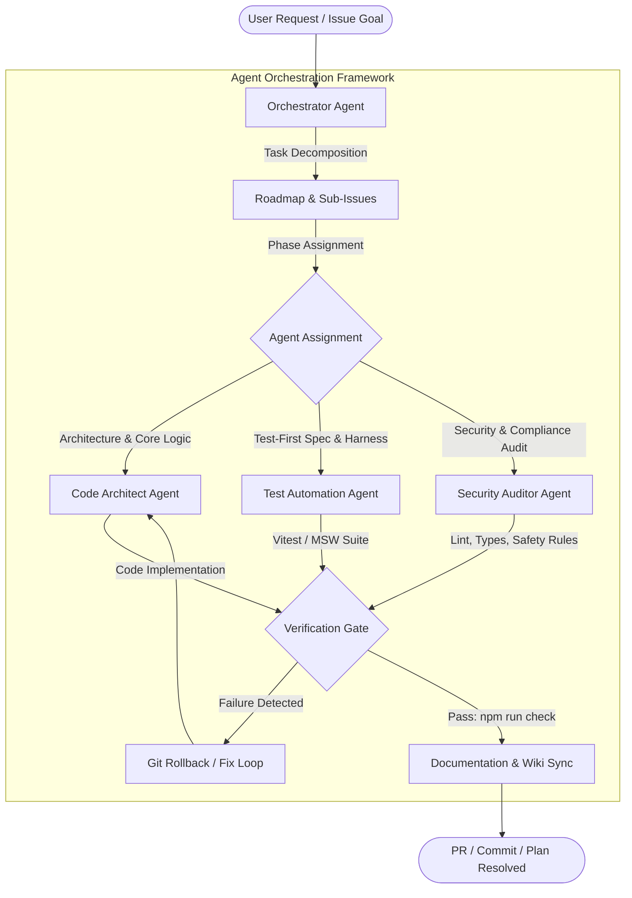

# AGENTS

This document is the central entry point and operating manual for all AI agents, coding assistants, and automated agents working on this repository.

## Project

**HELIX RSS** is a self-hosted, multi-user RSS/Atom-to-Discord service built in TypeScript ESM.
- **Runtime dependencies**: Minimal (uses native Node.js `http`, `node:sqlite`, and web standard APIs; in-memory `ioredis-mock` for coordination without external redis binaries).
- **Architecture**: In-memory write-through repository layer (`AppState`), native SQLite persistence, integrated dashboard UI with Light/Dark themes, Discord OAuth authentication, and direct message embed delivery to Discord channels.

---

## Current Issues

This section documents active and recently resolved critical issues as required by project tracking standards:

### 1. Cloudflare OAuth Failure & Retirement (Resolved / Retired)
- **Problem**: Cloudflare OAuth login failed with `Page not found: The route /oauth/error does not exist`. Furthermore, Cloudflare OAuth requires custom domains and public SSL certificates which cannot be sustained under self-hosted zero-cost requirements.
- **Resolution**:
  - Cloudflare OAuth provider and dependencies were retired entirely from the codebase.
  - Dedicated `/oauth/error` and `/api/oauth/error` routes were implemented in `src/dashboard/routes/oauth.ts` and `src/dashboard/http/oauth-callback.ts` to ensure clean error recovery.
  - Discord OAuth remains the primary authentication and authorization provider.
  - The obsolete `Integrations` tab was removed from the dashboard navigation.
  - In-dashboard OAuth credential configuration was removed from Settings to avoid out-of-sync credential state; configuration is exclusively handled through `.env`.

### 2. Legacy Webhook Terminology in Dashboard UI (Resolved)
- **Problem**: Earlier iterations of the dashboard referenced "Webhooks" and "Missing Webhooks", whereas the service now posts directly to Discord channels via the bot.
- **Resolution**: UI labels, modal subtitles, diagnostic metrics, and status badges were updated to reflect direct Discord Channel delivery.

### 3. Theme Support (Resolved)
- **Problem**: The dashboard was dark-mode only without theme customization.
- **Resolution**: Fully responsive Light and Dark themes were implemented with auto-detection via `prefers-color-scheme`, local storage persistence, and an interactive toggle in the header.

### 4. Site Status Monitors Retirement (Resolved / Retired)
- **Problem**: Site status monitors added unnecessary complexity and maintenance overhead without Cloudflare support.
- **Resolution**: Decommissioned and removed status monitoring across backend services, SQLite persistence, dashboard UI, and bot commands (`/monitor`). Service is streamlined to focus exclusively on RSS/Atom/Scrape feeds to Discord.

### 5. Cloud Hosting Retirement (Resolved / Retired)
- **Problem**: Cloud PaaS targets (Heroku, Render, Fly.io, Railway, Vercel) and one-click deploy buttons added maintenance overhead, inconsistent environment handling, out-of-sync credentials, and continuous platform-blocking/payment barriers.
- **Resolution**:
  - **All cloud hosting was retired**; the service is self-hosted exclusively on **Local**, **VPS**, and **Docker**.
  - `app.json`, the Deploy to Heroku button, and the Heroku `Procfile` were removed.
  - PaaS-only `$PORT` binding handling was removed from `src/config.ts`; port binding is configured via `INTERNAL_URL` / `DISCORD_PORT`.
  - Deployment documentation in `README.md` and `wiki/Deployment-and-Hosting.md` now covers only Local, VPS, and Docker.

---

## Agent Ecosystem Architecture & Orchestration

The repository operates on a multi-agent team model where agents collaborate, decompose tasks, execute automated verification, and maintain documentation synchronization.

---

## Agent Team Catalog & Capabilities

| Agent | Target Domain | Key Responsibilities | Specification File |
|---|---|---|---|
| **Orchestrator** | Project Management & Workflow | Task decomposition, roadmap execution, permission handling, user approval gateways, rollback coordination | [orchestrator.md](.agents/agents/orchestrator.md) |
| **Code Architect** | Backend & UI Engineering | TypeScript ESM architecture, zero-unsolicited runtime injection, SQLite write-through state, HTTP routing | [code-architect.md](.agents/agents/code-architect.md) |
| **Test Automation** | Quality Assurance | Test-driven development (TDD), Vitest suite, mock servers, MSW handlers, regression coverage | [test-automation.md](.agents/agents/test-automation.md) |
| **Security Auditor** | Security & Code Quality | Vulnerability scanning, secrets protection, ESLint rule enforcement, Prettier formatting, dependency audits | [security-auditor.md](.agents/agents/security-auditor.md) |
| **Feed Watcher** | RSS/Atom Ingestion | Feed polling, HTML scraping, XML parsing, deduplication, Discord embed formatting and dispatch | [feed-watcher.md](.agents/agents/feed-watcher.md) |

---

## Standard Agent Execution Capabilities

All agents have access to and must leverage the repository's standard execution toolset:
1. **File System Operations**: Read, write, and patch files with rigorous error handling and path resolution.
2. **Type Checking**: `npm run typecheck` (`tsc --noEmit`).
3. **Linting & Fixing**: `npm run lint` (`eslint src tests --max-warnings 0`) and automatic correction.
4. **Code Formatting**: `npm run format` and validation via `npm run format:check`.
5. **Automated Testing**: `npm test` (`vitest run`) and `npm run test:watch`.
6. **Full Validation Gate**: `npm run check` (runs typecheck, format check, linting, and all unit + integration tests in one unified command).
7. **Compilation**: `npm run build` (outputs to `dist/`).
8. **Version Control & Rollbacks**: `git status`, `git diff`, `git checkout`, `git restore` for safe rollbacks whenever test regressions occur.

---

## Agent Rules (`.agents/rules/`)

All agent actions are bound by `.agents/rules/`:
- **Rule 00 (`agent-safety-compliance.md`)**: Safety invariants, zero irreversible damage, credentials/tokens stay in `.env`, never committed.
- **Rule 01 (`zero-unsolicited-injection.md`)**: Runtime dependencies require explicit user approval; only standard dev tooling is permitted.
- **Rule 02 (`typescript-architecture.md`)**: Strict TypeScript ESM structure across `src/`.
- **Rule 03 (`message-formatting.md`)**: Embed building and Discord channel routing standards.
- **Rule 04 (`remote-issue-protocol.md`)**: Roadmap-first tracking; the first post is the roadmap edited as progress occurs; Mermaid diagrams required.
- **Rule 05 (`documentation-standards.md`)**: Keep `wiki/` and agent files synchronized (documentation is hosted entirely via `wiki/`).

---

## Testing & Verification Standard

- Always run `npm run check` before submitting changes.
- Never write ad-hoc scratch scripts outside the `tests/` directory.
- Mocks and test helpers must reside in `tests/helpers/` and `tests/mocks/`.