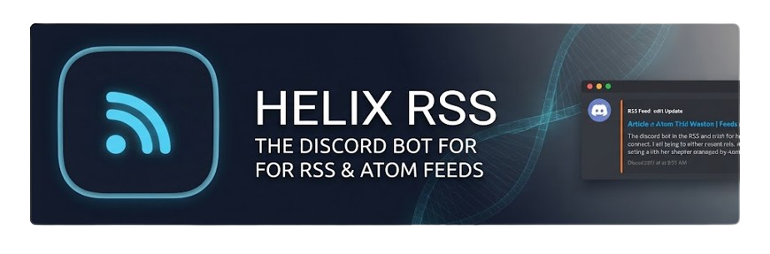

<div align="center">

<h1>HELIX RSS</h1>
<p>A lightweight and efficient utility designed to bridge RSS and Atom feeds directly into Discord channels.</p>
</div>

## Overview

**HELIX RSS** automates content delivery from RSS and Atom feeds straight into your Discord server channels using the built-in Discord Bot. Whether you're tracking release logs, blog updates, or news streams, this tool keeps your community in the loop without manual monitoring.

## Features

* **Automated Feed Polling:** Regularly checks configured RSS/Atom endpoints for new items with hourly rate-limiting.
* **Discord Bot Channel Integration:** Cleanly formats and pushes rich embed updates straight to designated channels, with interactive Discord slash commands (`/feed`, `/stats`, `/about`, `/help`).
* **Lightweight and Efficient:** Minimal resource usage with zero runtime dependencies while maintaining high performance.

## Documentation & Wiki

Detailed guides, configuration instructions, and advanced setup documentation are maintained in the project wiki:

* [Home & Getting Started](https://github.com/HELIX-Origin/HELIX-RSS/wiki/Home)
* [Configuration Guide](https://github.com/HELIX-Origin/HELIX-RSS/wiki/Configuration)
* [Troubleshooting](https://github.com/HELIX-Origin/HELIX-RSS/wiki/Troubleshooting)

## 🚀 One-Click Cloud Deployment

Deploy HELIX RSS to your preferred cloud provider with one click:

| Platform | Quick Deploy | Configuration |
|---|---|---|
| **Render** | [](https://render.com/deploy?repo=https://github.com/HELIX-Origin/HELIX-RSS) | [Render Guide](https://github.com/HELIX-Origin/HELIX-RSS/wiki/Deployment-and-Hosting#3-render) |
| **Railway** | [](https://railway.app/template/helix-rss) | [Railway Guide](https://github.com/HELIX-Origin/HELIX-RSS/wiki/Deployment-and-Hosting#2-railway) |
| **Heroku** | [](https://heroku.com/deploy?template=https://github.com/HELIX-Origin/HELIX-RSS) | [Heroku Guide](https://github.com/HELIX-Origin/HELIX-RSS/wiki/Deployment-and-Hosting#4-heroku) |
| **Fly.io** | [`fly launch`](https://fly.io/docs/hands-on/launch-app/) | [Fly.io Guide](https://github.com/HELIX-Origin/HELIX-RSS/wiki/Deployment-and-Hosting#1-flyio) |

## Installation & Setup

1. **Clone the repository:**

   ```bash
   git clone https://github.com/HELIX-Origin/HELIX-RSS.git
   cd HELIX-RSS
   npm install
   npm run build
   npm start
   ```

> 📖 For a reproduction-safe, step-by-step walkthrough (install, configure, add feeds, verify delivery, reset state), see the [Wiki](https://github.com/HELIX-Origin/HELIX-RSS/wiki).

## Contributing

* 💡 Contributions are welcome! Please fork the repository and submit pull requests for any improvements or bug fixes.
* 📝 Report issues and suggest features through the GitHub issue tracker.
* 🔧 Ensure that your code follows the project's coding standards and includes appropriate tests where applicable.
* 💬 Participate in discussions and provide constructive feedback on other contributors' pull requests.
* 🔄 Keep your fork up to date with the main repository to minimize merge conflicts.
* 📜 Follow the project's code of conduct to maintain a respectful and collaborative community environment.
* 📖 Review the project wiki for any changes in configuration or usage instructions to ensure smooth operation.
* 🧪 Test the setup in a controlled environment before deploying it to a live server to prevent disruptions.
* 💾 Regularly back up your configuration and important data to avoid loss in case of unexpected issues.
* 📊 Monitor the application's performance and resource usage to ensure it operates efficiently and does not negatively impact your Discord server.
* 👀 Keep an eye on the RSS feed sources for any changes in structure or availability that might affect the application's ability to fetch and post updates.
* 🌐 Engage with the community through discussions and forums to stay updated on best practices and common issues.
* 📝 Provide feedback and suggestions to help improve the project and its documentation.
* 🔔 Stay informed about updates and changes in Discord's API that might affect bot messaging functionality.

## Community Links

* 😎 [HELIX Origin Discord](https://discord.com/invite/Ww3XBZC2HV)
* 🌐 [Project Wiki](https://github.com/HELIX-Origin/HELIX-RSS/wiki)
* 🐛 [Issue Tracker](https://github.com/HELIX-Origin/HELIX-RSS/issues)
* 💡 [Feature Requests](https://github.com/HELIX-Origin/HELIX-RSS/issues?q=is%3Aissue+is%3Aopen+label%3A%22feature+request%22)