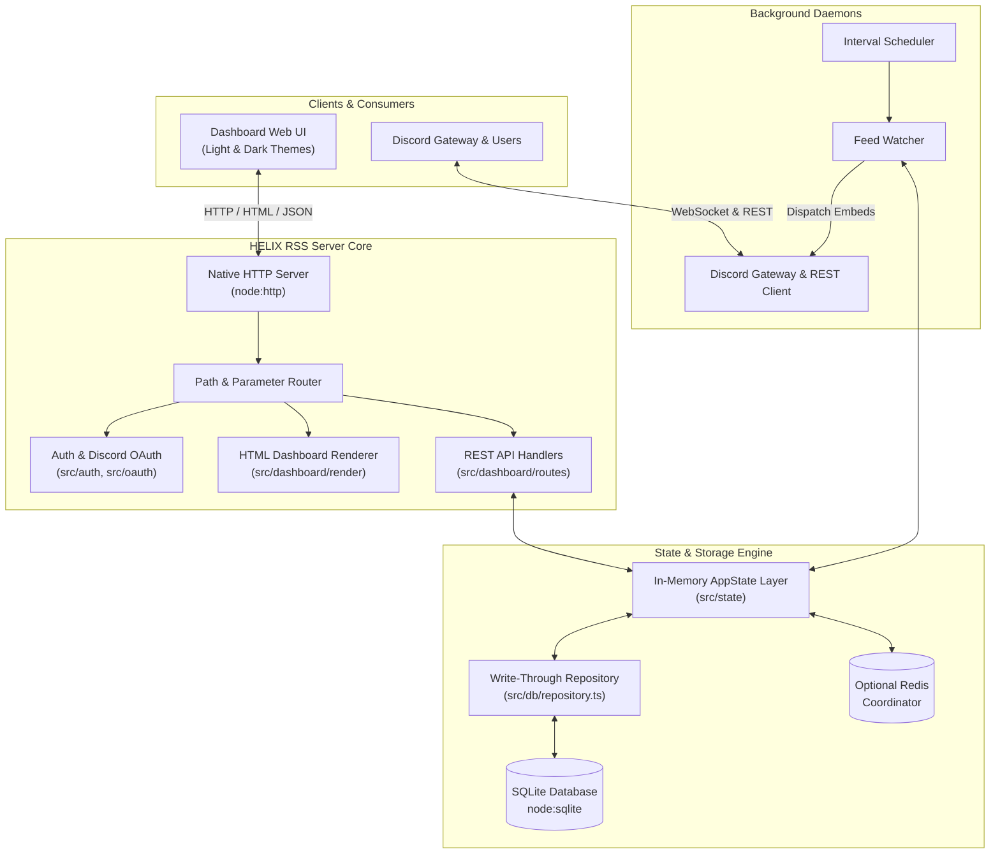
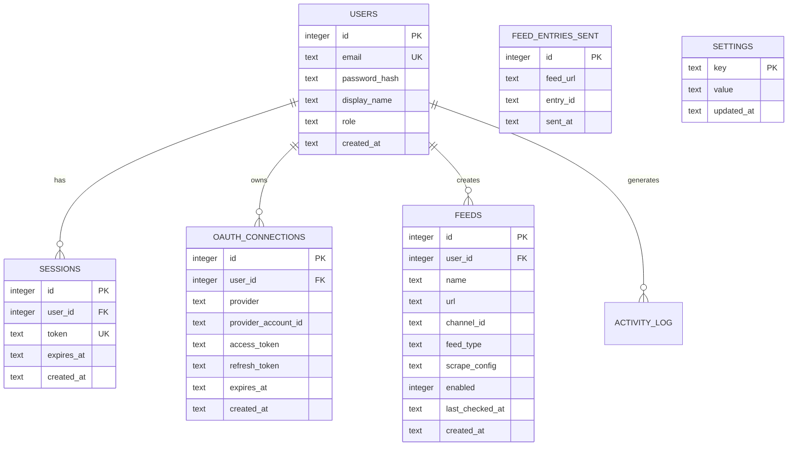

# Architecture and Design Specification

This document provides a technical overview of the HELIX RSS architecture, database schema, backend services, frontend dashboard, and REST API.

---

## 🏛️ System Architecture

---

## 🗄️ Database Schema & Entity Relationships

The database is built on `node:sqlite` without external ORMs or runtime query builders. `AppState` caches all records in memory for zero-latency lookups and performs synchronous write-through commits to SQLite.

---

## ⚙️ Backend Services

1. **`OAuthService` (`src/oauth/service.ts`)**:
   - Handles OAuth 2.0 authorization code grant for Discord.
   - Generates and cleans up cryptographically random, short-lived states.
   - Provides safe error routing via `/oauth/error`.
2. **`FeedWatcher` (`src/feed/watcher.ts`)**:
   - Polls user feeds at configurable intervals.
   - Uses `fetchRaw` with byte-capping and timeout limits.
   - Detects Cloudflare anti-bot blocks without crashing.
   - Evaluates GUIDs to prevent duplicate posts.
   - Formats rich Discord embeds and delivers them directly to configured Discord channels.
3. **`StatusWatcher` (`src/status/watcher.ts`)**:
   - Evaluates endpoint uptime and health via periodic HTTP requests.
   - Emits alerts only on state transitions (`online -> down` or `down -> online`).
4. **`DiscordRestClient` & `DiscordGatewayClient` (`src/bot/`)**:
   - Connects to the Discord WebSocket Gateway v10.
   - Automatically registers global slash commands.
   - Queries the Discord API for application ownership to grant automatic admin/owner privileges.

---

## 🎨 Frontend & Dashboard Design

- **Light and Dark Themes**: Fully responsive UI styled with CSS variables and Tailwind. Auto-detects OS theme preference via `matchMedia('(prefers-color-scheme: dark)')` and provides an instant toggle in the navigation bar.
- **Glassmorphic Aesthetic**: Translucent cards with backdrop filters and border illumination.
- **Direct Discord Channel Picker**: Dynamically discovers all channels available to the bot across the user's servers.

---

## 🔌 REST API Reference

| Method | Endpoint | Description | Auth Required |
|---|---|---|---|
| `GET` | `/health` | Service uptime and protocol status | No |
| `GET` | `/oauth/error` | OAuth error recovery landing page | No |
| `POST` | `/api/auth/login` | Local session authentication | No |
| `GET` | `/api/auth/discord` | Initiate Discord OAuth flow | No |
| `GET` | `/api/auth/callback/discord` | Complete Discord OAuth flow | No |
| `GET` | `/api/auth/me` | Current user profile & connections | Yes |
| `POST` | `/api/auth/logout` | Invalidate current session | Yes |
| `GET` | `/api/feeds` | List all feeds for authenticated user | Yes |
| `POST` | `/api/feeds` | Create a new RSS or Scrape feed | Yes |
| `PATCH` | `/api/feeds/:id` | Update feed settings or toggle active state | Yes |
| `DELETE` | `/api/feeds/:id` | Delete a feed | Yes |
| `POST` | `/api/feeds/:id/poll` | Trigger an immediate manual poll | Yes |
| `GET` | `/api/presets` | List popular feed templates | Yes |
| `GET` | `/api/discord/channels` | List Discord servers and channels | Yes |
| `GET` | `/api/settings` | Service settings (Base URL) | Admin / Owner |
| `POST` | `/api/settings` | Update service public base URL | Admin / Owner |
| `GET` | `/api/settings/users` | List all registered members | Admin / Owner |
| `GET` | `/api/settings/diagnostics/feeds` | System-wide feed health diagnostics | Admin / Owner |
