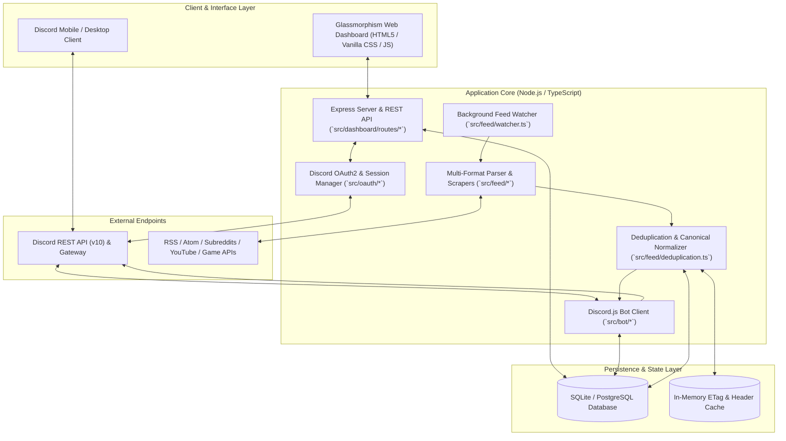
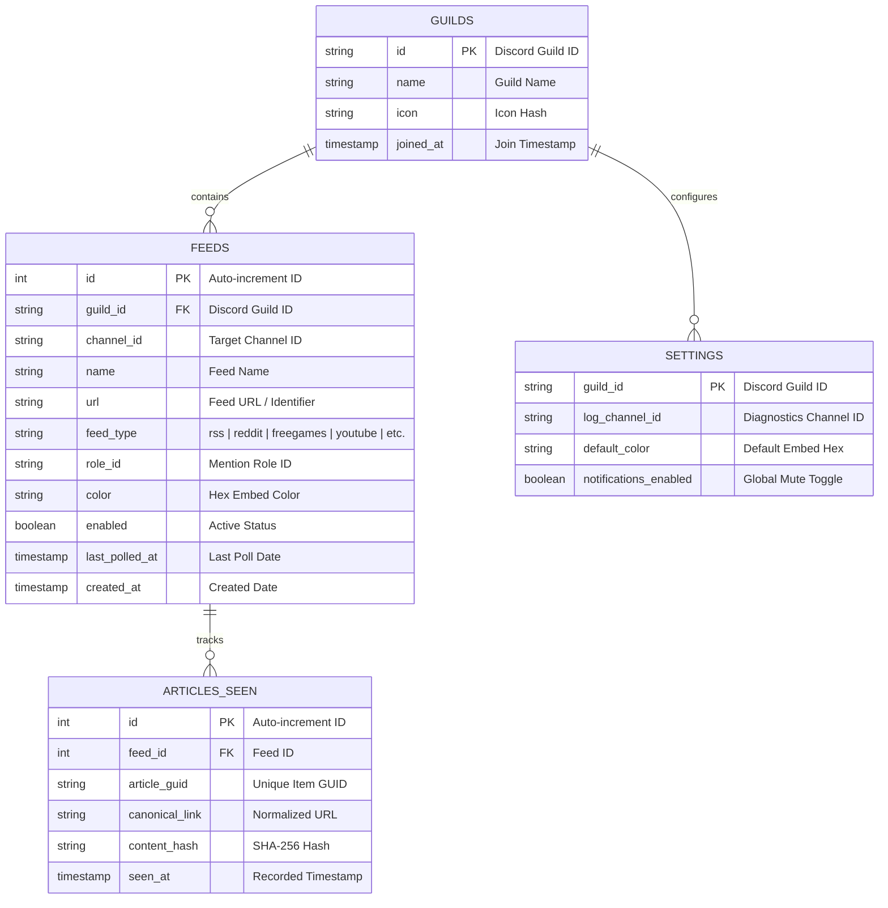

# 🏗️ Architecture & System Design

Discord-RSS is engineered as a modular, asynchronous TypeScript application combining a background polling daemon, an Express REST API & Web Dashboard, and a Discord.js bot client.

---

## 📐 System Architecture Overview

---

## 🧩 Core Components Breakdown

### 1. Web Dashboard & API (`src/dashboard/`)
- Built with **Express 4.x**, serving a responsive, zero-dependency Vanilla CSS & JavaScript frontend.
- **Glassmorphism Design**: High-contrast dark theme, backdrop blurs, animated status badges, and smooth tab transitions.
- **REST Endpoints**: CRUD operations for feeds, guild channel inspection, role listing, live log streaming, and manual test triggers.

### 2. Background Feed Watcher (`src/feed/watcher.ts`)
- Operates on a continuous polling loop with configurable intervals (`POLL_INTERVAL=300`).
- Runs balanced asynchronous worker pools with concurrency controls (`FEED_CONCURRENCY=5`).
- Features a weekly Monday cron scheduler for Free Games promotions.

### 3. Parser & Scrapers Engine (`src/feed/`)
- Unified parser handling XML (RSS/Atom), JSON Feed, Reddit, YouTube, TikTok, Bluesky, and Free Games storefronts.
- Sanitizes malformed XML, extracts CDATA payloads, resolves relative links, and cleans HTML tags for Discord embed descriptions.

### 4. Persistence Layer (`src/db/`)
- Abstracted database driver supporting both **SQLite** (default for single-node deployments) and **PostgreSQL** (for scalable enterprise hosting).
- Schema includes `feeds`, `guilds`, `settings`, `articles_seen`, and `stats_events`.

---

## 💾 Database Schema Reference

