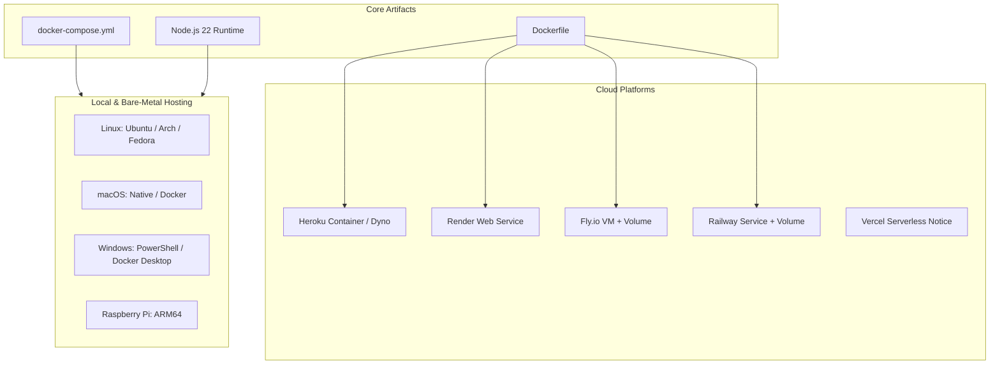

# Deployment and Hosting Guide

This guide covers deployment instructions for cloud platforms and local hosting across multiple operating systems.



---

## 🐳 Containerized Deployment (Docker & Docker Compose)

The repository provides a production-grade multi-stage `Dockerfile` and `docker-compose.yml`.

### Quick Start with Docker Compose

```bash
# Clone the repository and configure environment
git clone https://github.com/HELIX-Origin/HELIX-RSS.git
cd HELIX-RSS
cp .env.example .env

# Edit .env with your DISCORD_TOKEN, DISCORD_CLIENT_ID, and DISCORD_CLIENT_SECRET
nano .env

# Build and start container in the background
docker compose up -d --build
```

- Data is persisted to `./data` on the host machine mounted into `/app/data`.
- Healthcheck polls `http://127.0.0.1:3131/health` automatically.

---

## ☁️ Cloud Platforms

> [!IMPORTANT]
> **Persistent Storage Requirement**: HELIX RSS utilizes `node:sqlite`. Ensure your cloud deployment attaches a persistent disk/volume mounted at `/app/data` (or the directory pointed to by `SQLITE_DATA`). Without persistent disks, container redeployments will reset the database.

---

### 1. Fly.io

Fly.io is well-suited for HELIX RSS because it supports persistent NVMe storage volumes and runs continuous background processes.

> [!NOTE]
> **Pricing Notice**: Fly.io offers pay-as-you-go pricing with a Hobby tier. Persistent volumes are billed around $0.15/GB per month. Free allowances may apply depending on your account status.

#### Option A: via `flyctl` CLI
```bash
# 1. Install flyctl and authenticate
curl -L https://fly.io/install.sh | sh
fly auth login

# 2. Launch the app (do not deploy immediately)
fly launch --no-deploy

# 3. Create a 1GB persistent volume for SQLite
fly volumes create helix_data --size 1 --region ord

# 4. Set required secrets
fly secrets set DISCORD_TOKEN="your_token" DISCORD_CLIENT_ID="your_id" DISCORD_CLIENT_SECRET="your_secret"

# 5. Attach volume in fly.toml:
# [mounts]
#   source = "helix_data"
#   destination = "/app/data"

# 6. Deploy
fly deploy
```

#### Option B: via Fly.io Dashboard
1. Create a new App in the Fly.io Web Dashboard.
2. Connect your GitHub repository.
3. In the **Volumes** tab, create a new volume named `helix_data` mounted at `/app/data`.
4. In the **Secrets** tab, add `DISCORD_TOKEN`, `DISCORD_CLIENT_ID`, and `DISCORD_CLIENT_SECRET`.
5. Trigger a deployment.

---

### 2. Railway

> [!NOTE]
> **Pricing Notice**: Railway operates on a usage-based execution plan (starting with the $5/month Hobby plan or usage credits). Volume storage is billed based on GB-hours.

#### Option A: via `railway` CLI
```bash
# 1. Install and login
npm i -g @railway/cli
railway login

# 2. Initialize project and link volume
railway init
railway volume add --mount-path /app/data

# 3. Configure environment variables
railway variables set DISCORD_TOKEN="your_token" DISCORD_CLIENT_ID="your_id" DISCORD_CLIENT_SECRET="your_secret"

# 4. Deploy
railway up
```

#### Option B: via Railway Dashboard
1. Click **New Project** -> **Deploy from GitHub repo**.
2. Select your `HELIX-RSS` repository.
3. In service settings, click **Add Volume** and set mount path to `/app/data`.
4. Under **Variables**, add `DISCORD_TOKEN`, `DISCORD_CLIENT_ID`, `DISCORD_CLIENT_SECRET`, and `SQLITE_DATA=/app/data`.
5. Under **Networking**, generate a public domain for external dashboard access.

---

### 3. Render

> [!NOTE]
> **Pricing Notice**: Persistent disks on Render require an upgraded Web Service (Team/Individual paid plan starting at $7/month for the instance plus $0.25/GB per month for persistent disks). Free tier instances do not support persistent disks.

#### Option A: via `render-cli`
```bash
# Install render CLI and create service pointing to Dockerfile with persistent disk
render services create web \
  --name helix-rss \
  --env docker \
  --disk-name helix-data:/app/data:1GB
```

#### Option B: via Render Dashboard
1. In the Render Dashboard, click **New +** -> **Web Service**.
2. Connect your Git repository.
3. Select **Docker** or **Node** as the runtime.
4. Under **Advanced** -> **Disks**, add a disk named `helix-data` mounted at `/app/data` with 1GB capacity.
5. Add your Discord environment variables (`DISCORD_TOKEN`, `DISCORD_CLIENT_ID`, `DISCORD_CLIENT_SECRET`).
6. Click **Create Web Service**.

#### Option C: 1-Click Blueprint (`render.yaml`)
1. Click the **Deploy to Render** button in `README.md`.
2. Render automatically imports `render.yaml` with the configured service, disk, and health checks.
3. Enter your Discord credentials and deploy.

> [!TIP]
> **Prevent Inactivity Sleep**: On Render Free tier, web services sleep after 15 minutes of inactivity. Set `PING_URL=https://<your-service>.onrender.com/health` in your Render environment variables to enable the built-in keep-alive network ping, keeping your bot continuously online.

---

### 4. Heroku

> [!NOTE]
> **Pricing Notice**: Heroku has discontinued free dynos. Standard Eco ($5/month) or Basic ($7/month) dynos are required. Heroku dynos feature an ephemeral filesystem; if restarting, SQLite files reset unless an external S3 backup or Redis coordinator is configured.

#### Option A: via `heroku-cli`
```bash
# 1. Login and create app
heroku login
heroku create helix-rss-bot

# 2. Set stack to container
heroku stack:set container

# 3. Set environment configuration
heroku config:set DISCORD_TOKEN="your_token" DISCORD_CLIENT_ID="your_id" DISCORD_CLIENT_SECRET="your_secret"

# 4. Push and release container
git push heroku main
```

#### Option B: via Heroku Dashboard
1. Create a new App in your Heroku Dashboard.
2. In the **Settings** tab, click **Reveal Config Vars** and enter your Discord credentials.
3. Under **Deploy**, connect your GitHub repository and enable automatic deploys.

---

### 5. Vercel

> [!CAUTION]
> **Architecture Notice**: Vercel is designed for serverless, stateless request/response execution. HELIX RSS runs a continuous background polling scheduler and a persistent Discord Gateway WebSocket connection. While the web dashboard can theoretically be exported to serverless functions, hosting the full continuous bot daemon on Vercel is not recommended. If deploying frontend assets to Vercel, run the HELIX RSS daemon on Fly.io, Railway, or a local server.

> [!NOTE]
> **Pricing Notice**: Vercel offers a generous Hobby tier for frontend deployments, but serverless function timeouts are capped at 10s (Hobby) or 60s (Pro).

#### Option A: via `vercel-cli`
```bash
vercel login
vercel link
vercel env add DISCORD_TOKEN
vercel deploy
```

#### Option B: via Vercel Dashboard
1. Import the Git repository from your Vercel Dashboard.
2. Configure environment variables under **Settings** -> **Environment Variables**.
3. Deploy.

---

## 🖥️ Local & Self-Hosted Bare-Metal

Running HELIX RSS locally or on your own hardware provides optimal performance, privacy, and zero hosting costs.

### 1. Linux

#### Ubuntu / Debian
```bash
# Install Node.js 22 LTS
curl -fsSL https://deb.nodesource.com/setup_22.x | sudo -E bash -
sudo apt install -y nodejs git

# Clone and setup
git clone https://github.com/HELIX-Origin/HELIX-RSS.git /opt/helix-rss
cd /opt/helix-rss
cp .env.example .env
npm ci
npm run build

# Setup systemd service for 24/7 background operation
sudo tee /etc/systemd/system/helix-rss.service << 'EOF'
[Unit]
Description=HELIX RSS Daemon
After=network.target

[Service]
Type=simple
User=ubuntu
WorkingDirectory=/opt/helix-rss
ExecStart=/usr/bin/npm start
Restart=always
RestartSec=10
EnvironmentFile=/opt/helix-rss/.env

[Install]
WantedBy=multi-user.target
EOF

sudo systemctl daemon-reload
sudo systemctl enable --now helix-rss
```

#### Arch Linux
```bash
# Install Node.js and npm
sudo pacman -S nodejs npm git

# Setup and run
git clone https://github.com/HELIX-Origin/HELIX-RSS.git
cd HELIX-RSS
npm ci && npm run build
npm start
```

#### Fedora / RHEL
```bash
# Install Node.js 22
sudo dnf module install -y nodejs:22
sudo dnf install -y git

# Setup and run
git clone https://github.com/HELIX-Origin/HELIX-RSS.git
cd HELIX-RSS
npm ci && npm run build
npm start
```

---

### 2. macOS

#### Option A: Native Node.js (via Homebrew / Official Installer)
1. Download and install Node.js 22+ from [nodejs.org](https://nodejs.org) or via Homebrew:
   ```bash
   brew install node@22 git
   ```
2. Clone and start:
   ```bash
   git clone https://github.com/HELIX-Origin/HELIX-RSS.git
   cd HELIX-RSS
   cp .env.example .env
   npm ci
   npm run build
   npm start
   ```

#### Option B: Docker Desktop on macOS
1. Install [Docker Desktop for Mac](https://www.docker.com/products/docker-desktop/).
2. Run `docker compose up -d --build` inside the repository.

---

### 3. Windows

#### Option A: Native Node.js & PowerShell
1. Download and run the official Node.js 22 Windows Installer (`.msi`) from [nodejs.org](https://nodejs.org).
2. Open PowerShell:
   ```powershell
   git clone https://github.com/HELIX-Origin/HELIX-RSS.git
   cd HELIX-RSS
   Copy-Item .env.example .env
   # Edit .env with your credentials
   notepad .env
   npm ci
   npm run build
   npm start
   ```

#### Option B: Docker Desktop on Windows (WSL 2)
1. Install [Docker Desktop for Windows](https://www.docker.com/products/docker-desktop/) with WSL 2 backend.
2. In PowerShell or Command Prompt:
   ```powershell
   docker compose up -d --build
   ```

---

### 4. Raspberry Pi (Raspberry Pi OS / ARM64)

The low memory footprint of HELIX RSS makes it an ideal fit for Raspberry Pi 3, 4, 5, or Zero 2W.

#### Option A: Native Raspberry Pi OS
```bash
# Install Node.js 22 LTS (ARM64 / ARMv7)
curl -fsSL https://deb.nodesource.com/setup_22.x | sudo -E bash -
sudo apt install -y nodejs git

# Setup
git clone https://github.com/HELIX-Origin/HELIX-RSS.git ~/helix-rss
cd ~/helix-rss
cp .env.example .env
npm ci
npm run build
npm start
```

#### Option B: Docker on Raspberry Pi
```bash
# Install Docker via convenience script
curl -fsSL https://get.docker.com -o get-docker.sh
sudo sh get-docker.sh
sudo usermod -aG docker $USER

# Run container
docker compose up -d --build
```
The multi-stage `Dockerfile` compiles automatically on ARM64.
