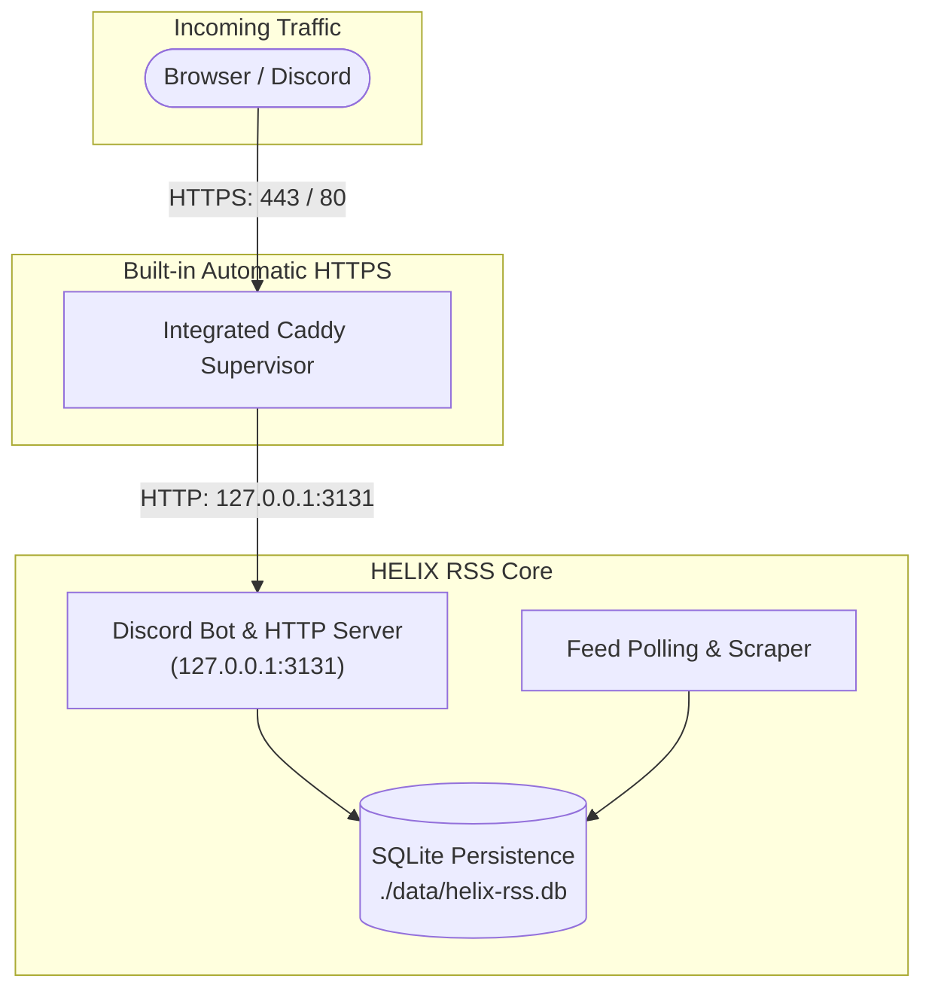

# Local & VPS Hosting Guide

This guide covers production deployment and self-hosting for HELIX RSS on **Local Machines** and **Virtual Private Servers (VPS)** across Linux, macOS, and Windows.



---

## 🔒 Built-in Automatic HTTPS (Integrated Caddy)

HELIX RSS includes a built-in, native **Caddy Reverse Proxy Supervisor** (`src/proxy/caddy.ts`). It automatically handles SSL certificates across all operating systems without requiring third-party npm dependencies or complex certificate managers.

### How It Works:
1. **Zero-Config Installation**: On first launch, HELIX RSS verifies if Caddy is present on your system. If not found, it downloads the official static Caddy binary into `./data/bin/` for your OS (Windows, Linux, or macOS) and architecture (`x64`, `arm64`).
2. **Local Testing (`localhost` or Custom Local Domains)**:
   - When using `tls internal` for `localhost` or custom dev domains (e.g. `your-domain.local`), Caddy automatically generates an internal Certificate Authority (CA) and issues local certificates.
   - To eliminate browser security warnings (`ERR_CERT_AUTHORITY_INVALID`), trust Caddy's local root certificate on your operating system (see [Trusting Caddy's Local CA](#-trusting-caddys-local-certificate-authority-custom-domains--local-tls) below).
3. **VPS with a Custom Domain**:
   - Set `PUBLIC_URL=https://rss.yourdomain.com` in `.env`.
   - Ensure DNS points your domain to your VPS IP and ports `80` and `443` are open.
   - Caddy automatically provisions and continuously renews production SSL certificates from **Let's Encrypt** or **ZeroSSL**.
4. **Lifecycle Management**: Caddy starts automatically alongside the bot and stops cleanly whenever the bot process shuts down.
5. **Opting Out**: Set `CADDY_ENABLED=false` in `.env` if you prefer to provide your own external reverse proxy (Cloudflare, Nginx, Traefik) or native SSL certificates via `SITE_SSL_KEY` and `SITE_SSL_CERT`.

---

## 🔏 Trusting Caddy's Local Certificate Authority (Custom Domains & Local TLS)

When using `tls internal` in your `Caddyfile` for local development or private home-lab servers (e.g., `https://localhost` or `https://your-domain.local`), Caddy generates an internal Root Certificate Authority (CA).

Because this CA is locally generated, web browsers will initially display a `net::ERR_CERT_AUTHORITY_INVALID` warning ("Your connection is not private") until the root certificate is trusted by your operating system.

### Root Certificate Locations

Caddy saves its local root CA certificate in your user profile:

| Operating System | Default Root CA Path |
| :--- | :--- |
| **Windows** | `%APPDATA%\caddy\pki\authorities\local\root.crt`<br>(`$env:APPDATA\caddy\pki\authorities\local\root.crt` in PowerShell) |
| **Linux** | `~/.local/share/caddy/pki/authorities/local/root.crt` |
| **macOS** | `~/Library/Application Support/Caddy/pki/authorities/local/root.crt` |

---

### Step-by-Step Trust Installation by Platform

#### 1. Windows (Chrome, Edge & System-Wide)

Modern Chromium-based browsers (Google Chrome, Microsoft Edge) enforce the **Chrome Root Store** on Windows, which strictly requires custom root certificates to be stored in the machine-wide `LocalMachine\Root` store.

1. Launch **PowerShell as Administrator** (Right-click Start > "Terminal (Admin)" or "Windows PowerShell (Admin)").
2. Import the Caddy root certificate directly into the Windows Root store:
   ```powershell
   certutil -addstore Root "$env:APPDATA\caddy\pki\authorities\local\root.crt"
   ```
3. Alternatively, if Caddy has been downloaded into `./data/bin/`, run the built-in trust command from an elevated prompt:
   ```powershell
   .\data\bin\caddy.exe trust
   ```
4. Restart Google Chrome / Microsoft Edge. The padlock will now display green and secure!

#### 2. Linux (Ubuntu, Debian, Raspberry Pi OS, Linux Mint)

1. Copy the Caddy root certificate into the system CA trust directory:
   ```bash
   sudo cp ~/.local/share/caddy/pki/authorities/local/root.crt /usr/local/share/ca-certificates/caddy-local.crt
   ```
2. Update the system CA trust store:
   ```bash
   sudo update-ca-certificates
   ```
3. (Optional) If you have the Caddy binary in `./data/bin/caddy`:
   ```bash
   sudo ./data/bin/caddy trust
   ```

#### 3. Linux (Fedora, RHEL, CentOS, Rocky Linux)

1. Copy the certificate to the anchors directory:
   ```bash
   sudo cp ~/.local/share/caddy/pki/authorities/local/root.crt /etc/pki/ca-trust/source/anchors/caddy-local.crt
   ```
2. Rebuild the certificate cache:
   ```bash
   sudo update-ca-trust
   ```

#### 4. Linux (Arch Linux & Manjaro)

Add the root certificate to the system trust anchors:
```bash
sudo trust anchor ~/.local/share/caddy/pki/authorities/local/root.crt
```

#### 5. macOS

1. Add the certificate to the system keychain:
   ```bash
   sudo security add-trusted-cert -d -r trustRoot -k /Library/Keychains/System.keychain ~/Library/Application\ Support/Caddy/pki/authorities/local/root.crt
   ```
2. Or use the Caddy CLI:
   ```bash
   sudo ./data/bin/caddy trust
   ```

---

### Browser-Specific Quirks

#### Google Chrome, Microsoft Edge, Brave, Opera
Chromium-based browsers rely directly on the operating system certificate store updated by the commands above. Simply restart the browser after installing the certificate.

#### Mozilla Firefox
By default, Firefox uses its own internal NSS certificate store and ignores operating system root certificates. To configure Firefox to trust your OS-level certificates:

1. In Firefox, enter `about:config` into the address bar and click **Accept the Risk and Continue**.
2. Search for:
   ```text
   security.enterprise_roots.enabled
   ```
3. Double-click the preference to toggle its value to **`true`**.
4. Restart Firefox.

*(Alternatively, you can manually import `root.crt` via Firefox **Settings** > **Privacy & Security** > **Certificates** > **View Certificates** > **Authorities** > **Import...** and check "Trust this CA to identify websites".)*

---

### Custom Local Domains via `hosts` File

If you want to access your local dashboard via a custom domain name (such as `https://your-domain.local`) instead of `https://localhost`:

1. **Map the Domain to Localhost**:
   - **Windows**: Edit `C:\Windows\System32\drivers\etc\hosts` (as Administrator).
   - **Linux / macOS**: Edit `/etc/hosts` (with `sudo nano /etc/hosts`).
   - Add the following line:
     ```text
     127.0.0.1  your-domain.local
     ```
2. **Configure your `Caddyfile`**:
   Create a `Caddyfile` in the project root:
   ```caddyfile
   your-domain.local, localhost {
       tls internal
       reverse_proxy 127.0.0.1:3131
   }
   ```
3. **Set `PUBLIC_URL` in `.env`**:
   ```env
   PUBLIC_URL=https://your-domain.local
   ```
4. Start HELIX RSS (`npm start`), trust the root certificate using the steps above, and open `https://your-domain.local` in your browser.

---

## 🖥️ VPS & Bare-Metal Hosting

### 1. Linux VPS (Ubuntu / Debian / Raspberry Pi OS)

#### Step 1: Install Node.js 22 LTS
```bash
curl -fsSL https://deb.nodesource.com/setup_22.x | sudo -E bash -
sudo apt install -y nodejs git tar
```

#### Step 2: Clone & Configure
```bash
git clone https://github.com/HELIX-Origin/HELIX-RSS.git /opt/helix-rss
cd /opt/helix-rss
cp .env.example .env

# Edit .env and enter your credentials and domain
# e.g. PUBLIC_URL=https://rss.yourdomain.com
nano .env

npm ci
npm run build
```

#### Step 3: Run as a 24/7 systemd Service
Create the service unit file:
```bash
sudo tee /etc/systemd/system/helix-rss.service << 'EOF'
[Unit]
Description=HELIX RSS Daemon
After=network.target

[Service]
Type=simple
User=ubuntu
WorkingDirectory=/opt/helix-rss
ExecStart=/usr/bin/npm start
Restart=always
RestartSec=10
EnvironmentFile=/opt/helix-rss/.env
AmbientCapabilities=CAP_NET_BIND_SERVICE

[Install]
WantedBy=multi-user.target
EOF
```

Enable and start the service:
```bash
sudo systemctl daemon-reload
sudo systemctl enable --now helix-rss

# Check service status and logs
sudo systemctl status helix-rss
sudo journalctl -u helix-rss -f
```

---

### 2. Arch Linux & Fedora / RHEL

#### Arch Linux
```bash
sudo pacman -S nodejs npm git tar
git clone https://github.com/HELIX-Origin/HELIX-RSS.git
cd HELIX-RSS
cp .env.example .env
npm ci && npm run build
npm start
```

#### Fedora / RHEL
```bash
sudo dnf install -y nodejs git tar
git clone https://github.com/HELIX-Origin/HELIX-RSS.git
cd HELIX-RSS
cp .env.example .env
npm ci && npm run build
npm start
```

---

### 3. macOS (Local & Mini Servers)

#### Native Execution via Homebrew
1. Install prerequisites:
   ```bash
   brew install node@22 git
   ```
2. Clone, build, and launch:
   ```bash
   git clone https://github.com/HELIX-Origin/HELIX-RSS.git
   cd HELIX-RSS
   cp .env.example .env
   npm ci
   npm run build
   npm start
   ```

---

### 4. Windows (Local & Windows Server)

#### Native PowerShell Setup
1. Install Node.js 22 LTS from [nodejs.org](https://nodejs.org).
2. Open PowerShell:
   ```powershell
   git clone https://github.com/HELIX-Origin/HELIX-RSS.git
   cd HELIX-RSS
   Copy-Item .env.example .env
   # Edit .env with your credentials
   notepad .env
   npm ci
   npm run build
   npm start
   ```

---

## 🐳 Docker & Docker Compose

The repository includes a production multi-stage `Dockerfile` and `docker-compose.yml`.

### Quick Start with Docker
```bash
# 1. Clone repository
git clone https://github.com/HELIX-Origin/HELIX-RSS.git
cd HELIX-RSS
cp .env.example .env

# 2. Edit .env with DISCORD_TOKEN, DISCORD_CLIENT_ID, DISCORD_CLIENT_SECRET, and PUBLIC_URL
nano .env

# 3. Launch container
docker compose up -d --build
```

- SQLite state and downloaded Caddy binaries persist in `./data` on the host machine.
- Container healthchecks monitor `http://127.0.0.1:3131/health` automatically.

---

## 🔧 Networking & Firewall Checklist

When deploying to a public VPS:
1. **Firewall / Security Groups**:
   - Allow inbound **Port 80** (HTTP - required for ACME Let's Encrypt challenges).
   - Allow inbound **Port 443** (HTTPS - public web traffic).
   - Keep internal port `3131` closed to the public internet (Caddy proxies to `127.0.0.1:3131` locally).
2. **DNS Configuration**:
   - Add an `A` record pointing `rss.yourdomain.com` to your VPS public IPv4 address.
   - (Optional) Add an `AAAA` record if using IPv6.
