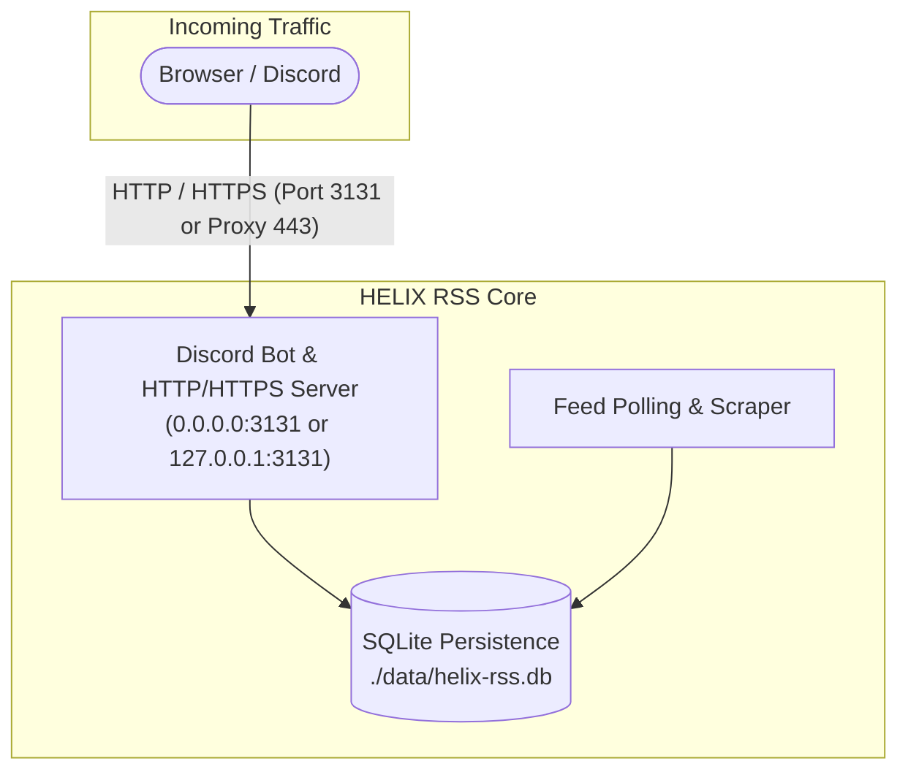

# Deployment & Hosting Guide (Local, VPS & Docker)

This guide covers production deployment and self-hosting for HELIX RSS on **Local Machines**, **Virtual Private Servers (VPS)**, and **Docker Containers**.



---

## 🔒 SSL & HTTPS Configuration

HELIX RSS supports direct native SSL/TLS or deployment behind any external reverse proxy (Nginx, Apache, Cloudflare).

### 1. Direct Native HTTPS
Provide your PEM certificate and private key paths in `.env`:
```env
SITE_SSL_KEY=/path/to/privkey.pem
SITE_SSL_CERT=/path/to/fullchain.pem
```
When configured, the unified server starts with native Node.js TLS encryption and automatically marks session cookies with the `Secure` attribute.

### 2. External Reverse Proxy (Nginx, Cloudflare)
If using an external reverse proxy:
- Set `PUBLIC_URL=https://your-domain.com` in `.env` for OAuth redirect generation.
- Forward proxy traffic to `http://127.0.0.1:3131`.

---

## 🖥️ VPS & Bare-Metal Hosting

### 🌐 Recommended Low-Cost Compatible VPS Providers

For high uptime, low network latency, and unshared IP routing (preventing Discord API or target site WAF rate limits), the following cost-effective VPS services are recommended:

| Provider | Starting Price | Key Benefits | Recommended Plan |
| :--- | :--- | :--- | :--- |
| [**Hetzner Cloud**](https://www.hetzner.com/cloud) | ~€3.79 / mo | Industry-leading price/performance, fast NVMe, EU/US locations | CX22 (2 vCPU, 4 GB RAM) / CAX11 |
| [**OVHcloud**](https://www.ovhcloud.com/en/vps/) | ~$4.20 / mo | Unmetered bandwidth, anti-DDoS, global datacenters | Starter / Value VPS |
| [**DigitalOcean**](https://www.digitalocean.com/) | ~$4.00 - $6.00 / mo | 1-Click Docker droplets, intuitive management, global regions | Basic Droplet (1-2 GB RAM) |
| [**Linode (Akamai)**](https://www.linode.com/) | ~$5.00 / mo | High network reliability, 24/7 support | Nanode 1GB / Shared 2GB |
| [**Vultr**](https://www.vultr.com/) | ~$3.50 - $5.00 / mo | 30+ worldwide datacenters, fast provisioning | Cloud Compute (1-2 GB RAM) |

---

### 1. Linux VPS (Ubuntu / Debian / Raspberry Pi OS)

#### Step 1: Install Node.js 22 LTS
```bash
curl -fsSL https://deb.nodesource.com/setup_22.x | sudo -E bash -
sudo apt install -y nodejs git tar
```

#### Step 2: Clone & Configure
```bash
git clone https://github.com/HELIX-Origin/HELIX-RSS.git /opt/helix-rss
cd /opt/helix-rss
cp .env.example .env

# Edit .env and enter your credentials and domain
# e.g. PUBLIC_URL=https://rss.yourdomain.com
nano .env

npm ci
npm run build
```

#### Step 3: Run as a 24/7 systemd Service

HELIX RSS includes a pre-configured, production-ready systemd unit file ([`helix-rss.service`](../helix-rss.service)) and an automated installer ([`scripts/install-service.sh`](../scripts/install-service.sh)) to keep the bot and dashboard running 24/7 across server restarts and crashes.

##### Option A: Automated Single-Command Installer (Recommended)
The installation script automatically detects your active user, working directory, Node/npm binaries, compiles the TypeScript build, creates the `./data` storage directory with appropriate permissions, installs the service unit, and starts it:

```bash
sudo ./scripts/install-service.sh
```

##### Option B: Manual systemd Configuration

If you prefer to configure systemd manually or installed the project to a custom path (e.g. `/var/www/helix-rss` or `/home/user/helix-rss`):

1. **Verify or Adjust the Service File (`helix-rss.service`):**
   ```ini
   [Unit]
   Description=HELIX RSS - 24/7 Self-Hosted Discord RSS/Atom Bot & Dashboard
   Documentation=https://github.com/HELIX-Origin/HELIX-RSS/wiki
   After=network.target network-online.target
   Wants=network-online.target

   [Service]
   Type=simple
   User=ubuntu
   Group=ubuntu
   WorkingDirectory=/opt/helix-rss
   ExecStart=/usr/bin/npm start
   Restart=always
   RestartSec=10
   TimeoutStopSec=20

   # Environment and capability bindings
   Environment=NODE_ENV=production
   EnvironmentFile=-/opt/helix-rss/.env
   AmbientCapabilities=CAP_NET_BIND_SERVICE
   CapabilityBoundingSet=CAP_NET_BIND_SERVICE

   # Security & Sandboxing hardening
   NoNewPrivileges=true
   ProtectSystem=full
   ProtectHome=read-only
   ReadWritePaths=/opt/helix-rss/data

   # Logging configuration
   StandardOutput=journal
   StandardError=journal
   SyslogIdentifier=helix-rss

   [Install]
   WantedBy=multi-user.target
   ```

2. **Customizing Key Directives for Your Setup:**
   - `User` & `Group`: Set to your Linux system username (e.g. `ubuntu`, `debian`, or a dedicated `helix` user). **Do not run as root.**
   - `WorkingDirectory`: The absolute path where the repo was cloned (e.g. `/opt/helix-rss`).
   - `ExecStart`: Full path to `npm` (find via `which npm`, e.g. `/usr/bin/npm` or `/usr/local/bin/npm`).
   - `EnvironmentFile`: Points to your `.env` configuration file containing bot secrets and domain settings.
   - `AmbientCapabilities=CAP_NET_BIND_SERVICE`: Allows the service to bind directly to privileged low ports (`80` and `443`) for native HTTPS without requiring root privileges.
   - `ReadWritePaths`: Grants write access to `./data` where SQLite database files (`data/helix-rss.db`) reside while keeping the rest of the OS filesystem protected.

3. **Install and Enable the Unit:**
   ```bash
   # 1. Copy the unit file into the systemd directory
   sudo cp helix-rss.service /etc/systemd/system/helix-rss.service

   # 2. Set strict file permissions
   sudo chmod 644 /etc/systemd/system/helix-rss.service

   # 3. Reload systemd to recognize the new service
   sudo systemctl daemon-reload

   # 4. Enable the service to start automatically on system boot
   sudo systemctl enable helix-rss

   # 5. Start the service immediately
   sudo systemctl start helix-rss
   ```

##### 🛠️ Managing and Monitoring the Service

| Action | Command |
| :--- | :--- |
| **Check service health & status** | `sudo systemctl status helix-rss` |
| **Stream live application logs** | `sudo journalctl -u helix-rss -f` |
| **View recent 100 log lines** | `sudo journalctl -u helix-rss -n 100 --no-pager` |
| **Restart the bot and dashboard** | `sudo systemctl restart helix-rss` |
| **Stop the service** | `sudo systemctl stop helix-rss` |
| **Disable automatic boot launch** | `sudo systemctl disable helix-rss` |

---

### 2. Arch Linux & Fedora / RHEL

#### Arch Linux
```bash
sudo pacman -S nodejs npm git tar
git clone https://github.com/HELIX-Origin/HELIX-RSS.git
cd HELIX-RSS
cp .env.example .env
npm ci && npm run build
npm start
```

#### Fedora / RHEL
```bash
sudo dnf install -y nodejs git tar
git clone https://github.com/HELIX-Origin/HELIX-RSS.git
cd HELIX-RSS
cp .env.example .env
npm ci && npm run build
npm start
```

---

### 3. macOS (Local & Mini Servers)

#### Native Execution via Homebrew
1. Install prerequisites:
   ```bash
   brew install node@22 git
   ```
2. Clone, build, and launch:
   ```bash
   git clone https://github.com/HELIX-Origin/HELIX-RSS.git
   cd HELIX-RSS
   cp .env.example .env
   npm ci
   npm run build
   npm start
   ```

---

### 4. Windows (Local & Windows Server)

#### Native PowerShell Setup
1. Install Node.js 22 LTS from [nodejs.org](https://nodejs.org).
2. Open PowerShell:
   ```powershell
   git clone https://github.com/HELIX-Origin/HELIX-RSS.git
   cd HELIX-RSS
   Copy-Item .env.example .env
   # Edit .env with your credentials
   notepad .env
   npm ci
   npm run build
   npm start
   ```

---

## 🐳 Docker & Docker Compose

The repository includes a production multi-stage `Dockerfile` and `docker-compose.yml`.

### Quick Start with Docker
```bash
# 1. Clone repository
git clone https://github.com/HELIX-Origin/HELIX-RSS.git
cd HELIX-RSS
cp .env.example .env

# 2. Edit .env with DISCORD_TOKEN, DISCORD_CLIENT_ID, DISCORD_CLIENT_SECRET, and PUBLIC_URL
nano .env

# 3. Launch container
docker compose up -d --build
```

- SQLite state persists in `./data` on the host machine.
- Container healthchecks monitor `http://127.0.0.1:3131/health` automatically.

---

## 🔧 Networking & Firewall Checklist

When deploying to a public VPS:
1. **Firewall / Security Groups**:
   - Allow inbound **Port 3131** (or port **443** for direct HTTPS / external reverse proxy).
2. **DNS Configuration**:
   - Add an `A` record pointing your domain or subdomain to your VPS public IPv4 address.
   - (Optional) Add an `AAAA` record if using IPv6.
