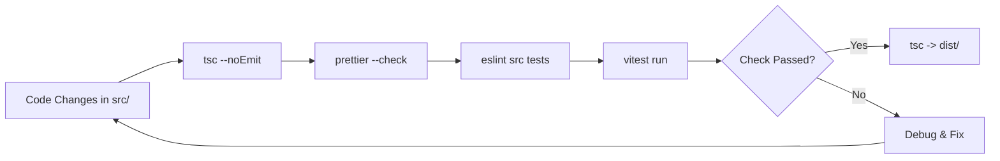

# Development, Testing & Verification Guide

This guide outlines engineering workflows for development, test automation, linting, code formatting, and verification gates.



---

## 🚀 Running the Project Locally

### Prerequisites
- Node.js `v22.9.0` or higher
- npm

### Development Launch
```bash
# 1. Install dependencies
npm ci

# 2. Build the TypeScript codebase
npm run build

# 3. Launch service in production mode
npm start

# 4. Or launch with TypeScript compilation watcher
npm run dev

# 5. In a separate terminal, launch the watcher runner
npm run dev:run
```

---

## 🧪 Testing Suite

All tests live in `tests/` and are powered by [Vitest](https://vitest.dev).
- **Unit Tests (`tests/unit/`)**: Fast, pure tests covering URL helpers, XML parsing, feed scrapers, HTTP routing, logger, and AppState entity mappers.
- **Integration Tests (`tests/integration/`)**: Complete tests exercising the server, API endpoints, Discord bot gateway, slash command dispatching, and scheduler loops with ephemeral SQLite databases.
- **Shared Helpers & Mocks (`tests/helpers/`, `tests/mocks/`)**: Shared test databases, factory fixtures, and Mock Service Worker (MSW) network interceptors.

### Running Tests
```bash
# Execute full test suite
npm test

# Run tests in interactive watch mode
npm run test:watch
```

---

## 🧹 Code Quality, Linting & Formatting

The codebase enforces strict ESLint rules and Prettier code formatting.

### Commands

| Command | Purpose |
|---|---|
| `npm run typecheck` | Run TypeScript compiler in check-only mode (`tsc --noEmit`) |
| `npm run lint` | Run ESLint across `src/` and `tests/` with `--max-warnings 0` |
| `npm run format` | Automatically format all source files using Prettier |
| `npm run format:check` | Verify that all files meet Prettier standards |
| `npm run check` | Execute typecheck, format check, lint, and test suite in one command |
| `npm run build` | Compile TypeScript into production-ready ESM bundle in `dist/` |

---

## 🛠️ Common Issues and Solutions

### 1. Port Conflict (`EADDRINUSE: 3131`)
- **Cause**: An earlier instance of the service or another process is bound to port 3131.
- **Solution**: The service includes an automatic preflight port-cleanup on startup. If running manually, terminate any existing process (`npx kill-port 3131` or `kill $(lsof -t -i:3131)`).

### 2. Experimental Warning on `localStorage`
- **Cause**: Node.js 22 emits a non-fatal warning when evaluating standard web APIs if `--localstorage-file` is not provided.
- **Solution**: This is a harmless runtime notice and does not affect the SQLite database or dashboard functionality.

### 3. Missing Discord Credentials
- **Symptoms**: Bot does not connect to the Gateway; Discord OAuth login returns an error.
- **Solution**: Set `DISCORD_TOKEN`, `DISCORD_CLIENT_ID`, and `DISCORD_CLIENT_SECRET` in `.env`. Ensure the bot is granted the `bot` and `applications.commands` OAuth2 scopes in the Discord Developer Portal.

### 4. Feed Blocks by Anti-Bot / Cloudflare
- **Symptoms**: Feed inspector reports "Cloudflare Anti-Bot Challenge detected".
- **Solution**: Some remote websites actively challenge non-browser user-agents. HELIX RSS gracefully catches these challenges, logs a diagnostic warning, and prevents service crashes.
