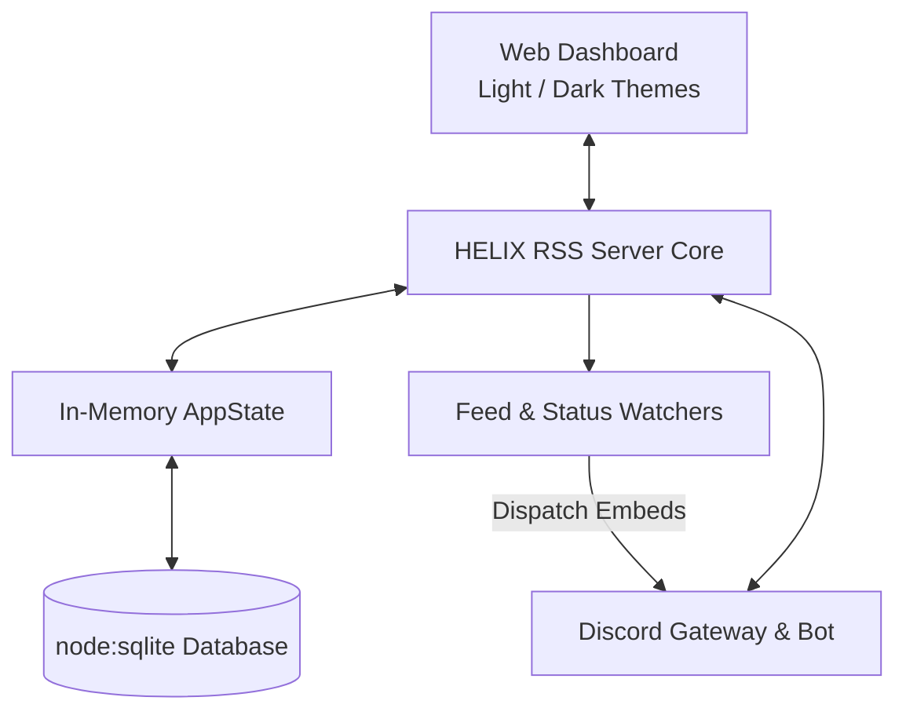

# Welcome to the HELIX RSS Wiki

**HELIX RSS** is a self-hosted, multi-user RSS/Atom-to-Discord service built in TypeScript ESM. It delivers feed updates directly to Discord channels via the built-in Discord Bot, provides an interactive Discord Bot with slash commands, and features a built-in web dashboard with zero required runtime dependencies.

---

## ⚡ Quick Start

### 1. Prerequisites

- **Node.js**: `v22.9.0` or higher (uses native `node:sqlite` and `--env-file-if-exists`).
- **Discord Bot**: A registered Application on the [Discord Developer Portal](https://discord.com/developers/applications).
- **Redis** _(optional)_: Used for cross-instance deduplication and distributed locks; runs automatically if installed on the host.

### 2. Installation & Setup

```bash
# Clone the repository
git clone https://github.com/HELIX-Origin/HELIX-RSS.git
cd HELIX-RSS

# Copy example environment configuration
copy .env.example .env

# Install dependencies, compile TypeScript, and launch
npm install
npm run build
npm start
```

### 3. Open the Dashboard

Navigate to <http://127.0.0.1:3131> in your web browser.

- Click **"Log In with Discord"** to authenticate.
- If you are the owner or team member of the Discord Application, the system automatically detects your Discord User ID from the Discord API and grants you full **Owner** access!
- Click **"Invite Bot to Server"** in the top navigation to add the Discord bot to your community.

---

## 📚 Documentation Index

| Guide | Description |
|---|---|
| [Architecture & Design](Architecture-and-Design) | System components, SQLite schema, REST API reference, and frontend architecture. |
| [Configuration](Configuration) | Complete guide to all environment variables and runtime settings. |
| [Deployment & Hosting](Deployment-and-Hosting) | Cloud deployment (Fly.io, Railway, Render, Heroku, Vercel) and local bare-metal hosting. |
| [Development & Testing](Development-and-Testing) | Development workflow, Vitest test suites, ESLint, Prettier, and verification gates. |
| [Discord Bot](Discord-Bot) | Developer Portal setup, permissions, owner detection, and slash commands. |
| [Feeds & Web Scraper](Feeds-and-Scrapers) | RSS/Atom feeds, custom CSS webpage scrapers, and presets. |
| [Integrations & Security](Integrations-and-Security) | Discord OAuth authentication, RBAC permissions, and native SSL/HTTPS. |
| [Troubleshooting](Troubleshooting) | Port conflict resolution, Redis diagnostics, Discord gateway, and SQLite. |

---

## 🏗️ Architecture Overview



- **Zero Runtime Dependencies**: Built entirely with Node.js built-ins (`node:http`, `node:https`, `node:sqlite`, `node:crypto`).
- **Discord-First Authentication**: Pure Discord OAuth authentication — no insecure passwords or complex user registration forms.
- **Theme Support**: Dynamic Light and Dark modes with automatic system detection and an instant header toggle.
- **Automated Port Preflight**: Scans and clears occupied ports (`3131`, `3132`, `3535`) automatically upon launch so the service boots without conflicts.
- **Embedded Redis Supervisor**: Automatically launches `redis-server` alongside the service when installed, with instant, zero-delay graceful fallback to standalone SQLite mode if Redis is absent.
- **Shared State**: Both the web dashboard and Discord Bot share the same SQLite database and in-memory caches for real-time synchronization.

---

## 💬 Community & Support

- **Discord Server**: [HELIX Origin Discord](https://discord.com/invite/Ww3XBZC2HV)
- **GitHub Issues**: [HELIX-Origin/Discord-RSS Issues](https://github.com/HELIX-Origin/Discord-RSS/issues)
