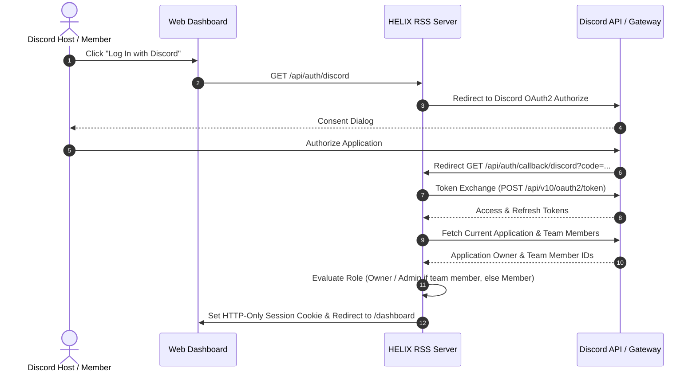
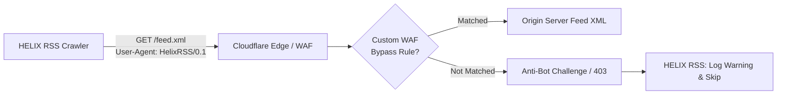

# Integrations, Security & Access Control

HELIX RSS provides robust authentication, role-based permissions, and security controls designed specifically for Discord community self-hosting.



---

## 🔐 Discord-First Authentication

HELIX RSS utilizes **Discord OAuth 2.0 authentication**:

- **No Passwords**: Eliminates credential stuffing, password hashing overhead, and registration forms.
- **Instant Provisioning**: Accounts, roles, and sessions are provisioned on-the-fly when authorizing via Discord.
- **Session Tokens**: Cryptographically secure 256-bit random tokens stored in SQLite and protected via HTTP-only session cookies.

---

## 👑 Discord Application Team & Access Control

Access control is linked directly to your **Discord Developer Application Team**:

- **Automatic Owner/Admin Detection**: When logging in, HELIX RSS verifies whether the user is the owner or a developer team member of the Discord Application associated with `DISCORD_TOKEN`. Team members automatically receive full administrative and owner privileges.
- **Two Simple Access Levels**:
  - **App Team (Admin/Owner)**: Full administrative access. Can access Dev Tools, view system-wide feed health diagnostics, trigger manual cache refreshes, and inspect all member feeds.
  - **Member**: Standard community member access. Can manage their personal feeds, custom scrape feeds, and select Discord channels available to the bot. Cannot access system settings or dev tools.

---

## 🛡️ Handling Anti-Bot & Cloudflare-Protected Feeds

Cloudflare OAuth has been retired due to the requirement for paid external domains and public SSL certificates. For targets hosted behind Cloudflare:



### Whitelisting the Crawler in Cloudflare WAF
If you own the target website hosted on Cloudflare, you can allow HELIX RSS to fetch your feed by adding a custom WAF bypass rule:

1. In your Cloudflare Dashboard, go to **Security** > **WAF** > **Custom Rules**.
2. Create a rule named `Allow HELIX RSS Crawler`.
3. Set the expression:
   ```text
   (http.user_agent contains "HelixRSS")
   ```
4. Set action to **Skip** (select *All remaining custom rules*, *WAF Managed Rules*, and *Bot Fight Mode*).
5. Ensure the rule is placed at the top (`position: 1`).

---

## 🚨 OAuth Error Recovery (`/oauth/error`)

In the event that an OAuth authorization flow is canceled or misconfigured, the server routes the user to a branded error recovery page (`/oauth/error`):
- Clearly informs the user of the failure reason without exposing internal server stack traces.
- Provides immediate navigation links back to `/dashboard` and `/login`.

---

## 🔒 SSL, HTTPS & Reverse Proxies
 
### 1. Direct Native SSL (HTTPS)

To host HELIX RSS with native Node.js HTTPS encryption directly, provide valid PEM certificates in `.env`:
 
```env
SITE_SSL_KEY=/path/to/privkey.pem
SITE_SSL_CERT=/path/to/fullchain.pem
```

When configured, the unified server boots with native Node.js TLS encryption and automatically marks session cookies with the `Secure` attribute.

### 2. External Reverse Proxies (Nginx, Apache, Cloudflare)

When running behind an external reverse proxy (e.g. Nginx, Apache, or Cloudflare Tunnels):
- Configure `PUBLIC_URL=https://your-domain.com` in `.env` to ensure Discord OAuth callback redirects resolve properly.
- Reverse proxies terminate SSL and forward traffic to HELIX RSS via `127.0.0.1:3131` (or `INTERNAL_URL`).
- HELIX RSS automatically inspects standard proxy headers such as `x-forwarded-proto: https` to enforce secure session cookie policies.
