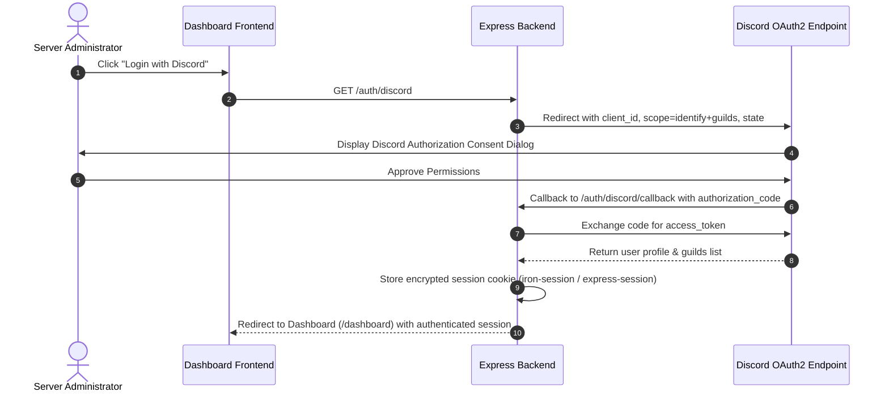

# 🔒 Integrations & Security

This guide details the security model, authentication flows, authorization rules, and data protection practices in Discord-RSS.

---

## 🔑 Discord OAuth2 Authentication Workflow

---

## 🛡️ Role-Based Access Control (RBAC)

1. **Server Administrator Authorization**:
   - Only users with the `Administrator` or `Manage Server` (`MANAGE_GUILD`) permissions on a given Discord server can view, create, edit, or delete feeds for that server.
   - Server lists are verified server-side on every API call against Discord's `/users/@me/guilds` endpoint.

2. **Global Application Owners**:
   - Users whose Discord IDs are listed in `OWNER_IDS` (or resolved automatically from the Discord Developer Portal Application info) have global access to server-wide diagnostics, global log streams, and system settings.

---

## 🛡️ Application Hardening & Security Standards

### 1. Direct Discord REST Delivery
- Rather than relying on public incoming webhooks (which can be leaked or hijacked if tokens are exposed), all deliveries use Discord's official REST API (`POST /channels/{channelId}/messages`) authorized with the bot's secret token.

### 2. Cross-Site Scripting (XSS) & HTML Sanitization
- All RSS descriptions and article snippets extracted from untrusted third-party web feeds are passed through an HTML entity decoder and strict HTML tag stripper before being formatted into Discord embeds or web UI cards.

### 3. Rate Limiting & Protection
- Express routes utilize rate limiting (`express-rate-limit`) on authentication endpoints and manual poll triggers (`POST /api/feeds/freegames/poll`, `POST /api/feeds/:id/test`) to prevent abuse and denial of service.

### 4. Database Parameterization
- All queries to SQLite and PostgreSQL use prepared parameterized statements, preventing SQL injection vulnerabilities.
